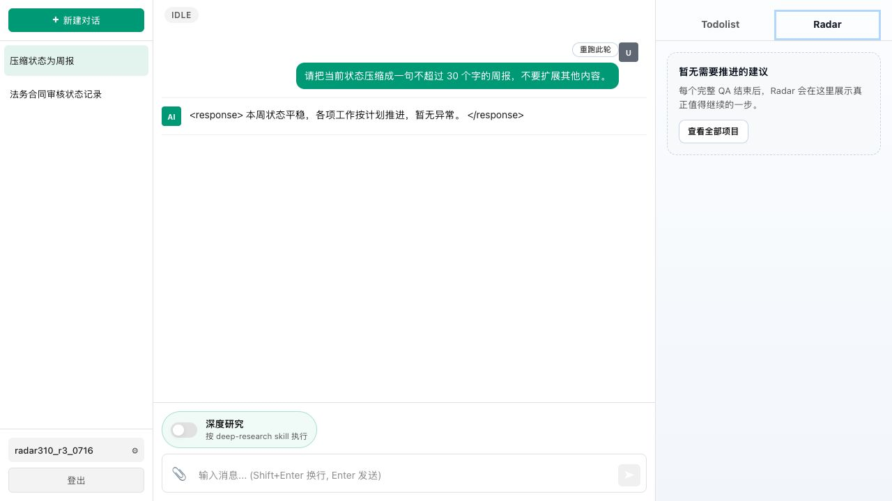

# 3.10 只有信息价值稳定性实测

> 实测日期：2026-07-16
> 
> 目的：验证仅记录外部等待状态、当前没有 Agent 可执行动作时，Radar 保持安静。

## 1. 最终脚本

### Session A

> 法务合同审核正在按计划进行，外部法务将在 T+2 天按约返回意见。目前无需催办，也没有需要提前准备的材料；收到意见后才能决定是否修改合同。请记录当前状态。

### Session B

> 请把当前状态压缩成一句不超过 30 个字的周报，不要扩展其他内容。

## 2. 三次结果

| 次数 | 账号 | Session A | Session B | Radar |
|---|---|---|---|---|
| 1 | `radar310_r1_0716` | 记录等待状态 | 返回“法务合同审核中，等外部意见返回后再定后续” | 安静 |
| 2 | `radar310_r2_0716` | 记录等待状态 | 返回“法务合同审核中，等外部意见返回后再定后续” | 安静 |
| 3 | `radar310_r3_0716` | 记录等待状态 | 返回“本周状态平稳，各项工作按计划推进，暂无异常” | 安静 |

## 3. 结论

三次都没有生成可执行 Radar，符合“只有信息价值、没有当前推进动作”的预期。主回答存在措辞差异，但没有越界产生催办、准备材料或泛化推进建议。

## 4. 证据截图

## 5. 判定

3.10 稳定性结果为 **3 / 3 通过**。
