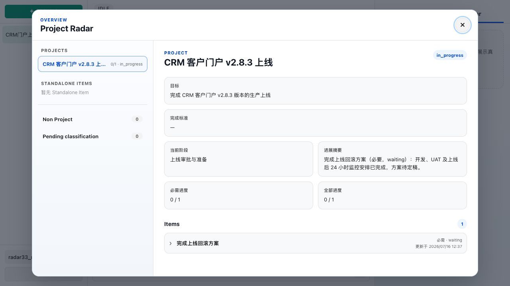
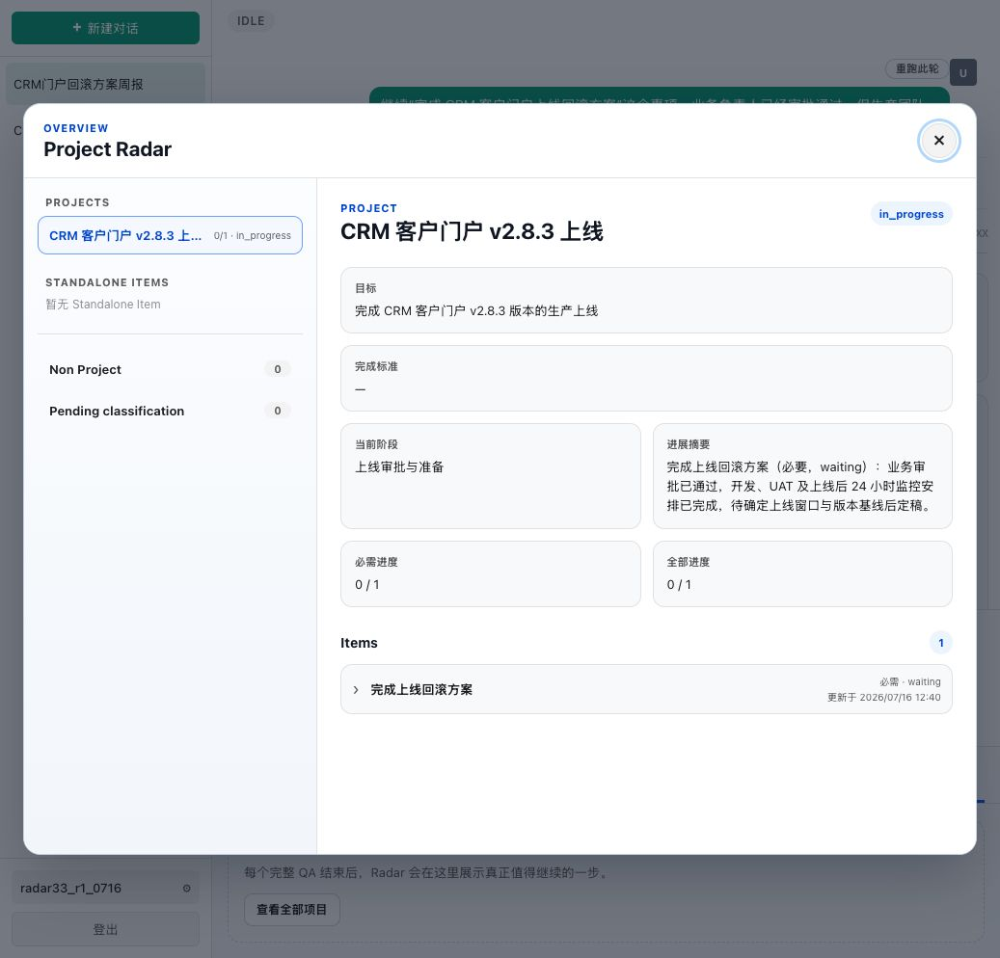
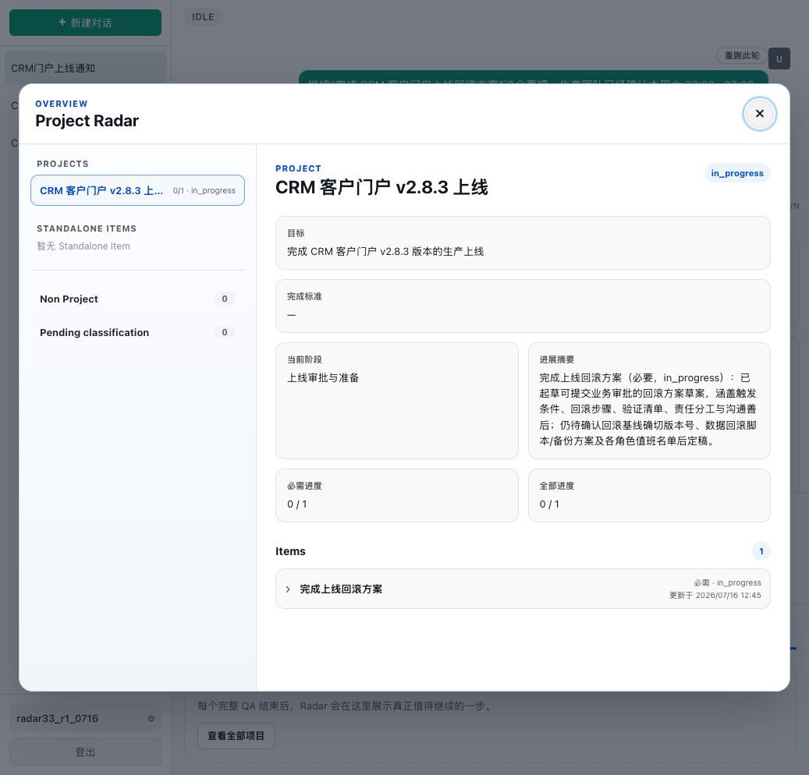
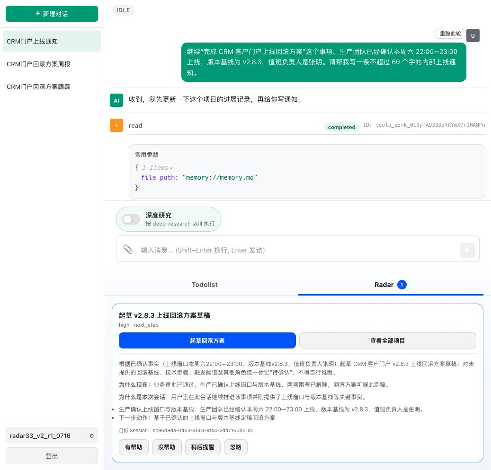
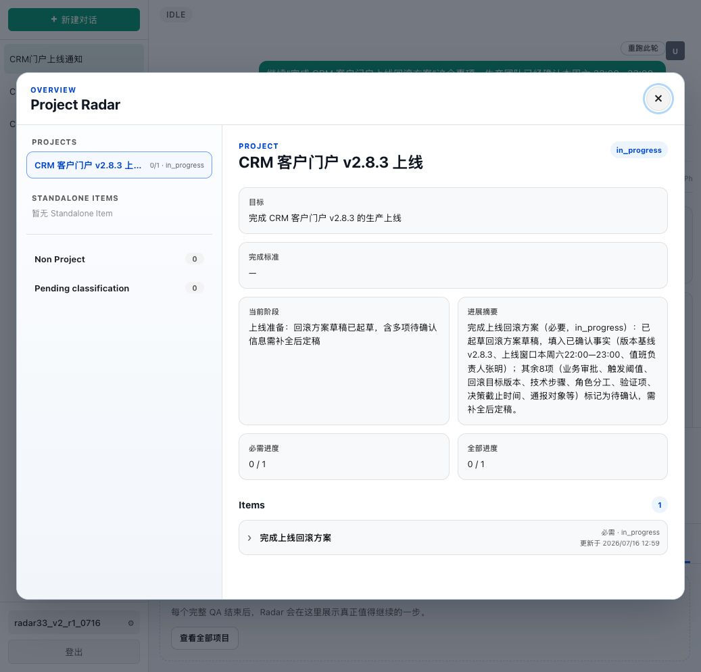

# 3.3 回滚方案稳定性实测

## 1. 验证目标

验证同一个“完成上线回滚方案”Item 的 blocker 跨 Session 逐步解除后，Radar 能在正确时机主动起草回滚方案，并在 Web 对话中形成受约束的可编辑草稿。最终脚本需要在相互隔离的新账号中连续通过三次。

## 2. 通过标准

1. Session A 只建立一个主要 Item，并保留审批、上线窗口和版本基线 blockers；Radar 安静。
2. Session B 继续更新原 Item，只解除审批 blocker；Radar 安静。
3. Session C 继续更新原 Item并解除其余 blockers；主 Agent 只生成内部通知，Radar 定向 Session C 建议起草回滚方案。
4. 点击 Radar 后生成 Web 文本草稿，已知事实准确，未知的回滚基线、技术步骤、触发阈值和其他角色标记“待确认”。
5. 执行结果作为 Event 回流原 Item，且不会递归生成 Radar。

## 3. 第一次执行：未通过

- 日期：2026-07-16
- 账号：`radar33_r1_0716`
- 脚本版本：单 Item 初稿
- 连续通过计数：`0 / 3`

### 3.1 Session A

状态正确：只形成 Project“CRM 客户门户 v2.8.3 上线”和 Item“完成上线回滚方案”；Item 为 `waiting`，开发、UAT 和 24 小时监控记录为已完成；Radar 安静。

### 3.2 Session B

状态正确：继续更新原 Item，业务审批已通过，仍等待上线窗口和版本基线；Radar 安静。

### 3.3 Session C 与 Radar

Radar 正确生成“起草定稿回滚方案”，决策为 `actionable_gap`，依赖判断为 `clear`，目标为 Session C。主 Agent 的内部上线通知没有覆盖该动作。

### 3.4 未通过原因

Action Runner 正常生成草稿并回流原 Item，但产物擅自假设回滚基线为 `v2.8.2`，并补充了未提供的角色、技术步骤和触发阈值。虽然结尾把部分内容列为待确认，正文仍把假设值当作既定方案使用，不符合通过标准。

执行后原 Item 保持 `in_progress`，Event 回流正常，没有递归 Radar。

## 4. Case 修订

根因属于 Case 约束不完整：评测标准要求“不得补造”，但首次用户输入没有把该规则明确交给 Agent。修订后的 Session A 增加项目级约束：回滚方案只能使用已确认事实；未提供的回滚基线、技术步骤、触发阈值和其他角色必须标记“待确认”。

脚本发生修改，连续通过次数清零。下一轮从新账号重新开始。

## 5. 修订版第一次执行：产品问题

- 日期：2026-07-16
- 账号：`radar33_v2_r1_0716`
- 脚本版本：单 Item + 项目级未知字段约束
- 连续通过计数：`0 / 3`
- 终态：`产品问题`

Session A、B 均按预期保持安静；Session C 正确生成“起草 v2.8.3 上线回滚方案草稿”，Radar 的动作文本已经包含“未确认字段统一标记待确认，不得自行推断”。

点击执行后，Action Runner 不再补造回滚基线和技术信息，但错误声称“本会话未告知业务审批是否通过”，并把 Session B 已经明确确认的审批结果重新列为待确认。执行后的 Item 也把业务审批写入八项待确认信息。

数据库证据显示：Session B 的 Radar 决策仍因 blockers 未解除而静默；Session C 的 Radar 决策为 `actionable_gap`，并明确以“业务审批已通过”为 `why_now` 依据。但 Radar 的 `context_snapshot` 只保存上线窗口、版本基线、值班负责人和待确认字段，没有把跨 Session 的“业务审批已通过”交给 Action Runner。

这不是继续修改用户措辞可以合理解决的问题。若在 Session C 重复审批状态，只会掩盖跨 Session Context Bundle 丢失事实。因此 3.3 停止调词，按“产品问题”终止本轮稳定性验证；不修改代码、不重启服务，继续执行其他 Case。
