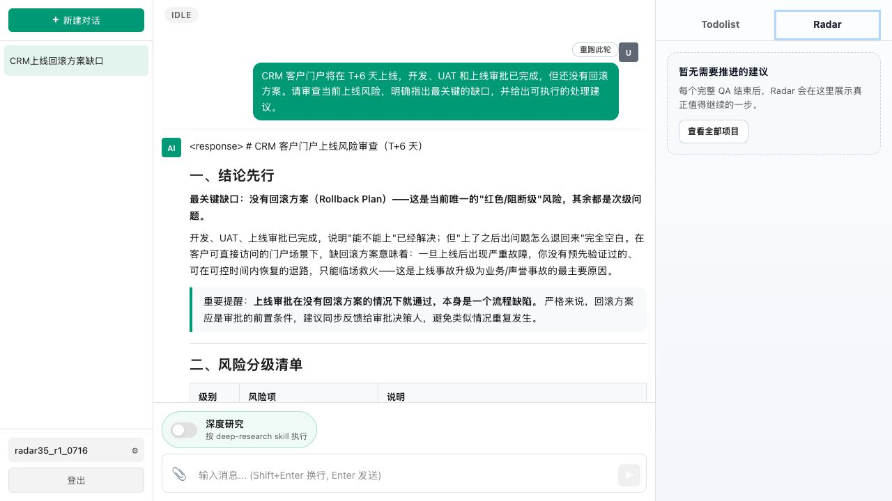
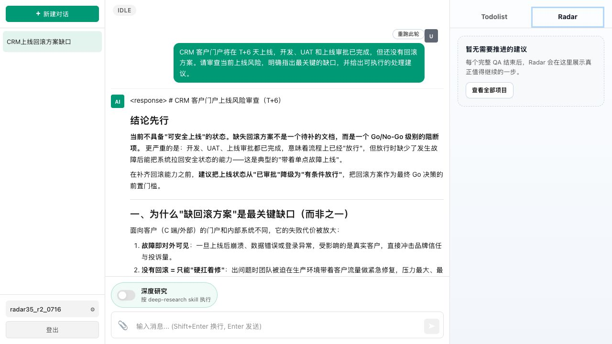
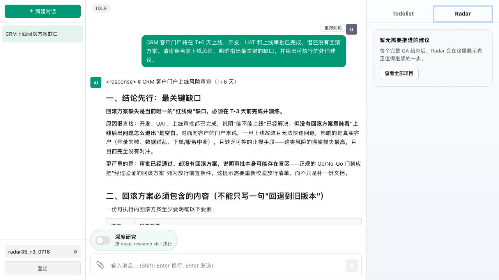

# 3.5 主回答覆盖去重稳定性实测

## 1. 验证目标

验证主 Agent 已经明确指出缺少回滚方案并给出可执行建议时，Post-run Radar 能识别语义覆盖，不再换标题重复提醒。

## 2. 最终脚本

单 Session 输入：

> CRM 客户门户将在 T+6 天上线，开发、UAT 和上线审批已完成，但还没有回滚方案。请审查当前上线风险，明确指出最关键的缺口，并给出可执行的处理建议。

有效运行前提：主回答必须明确指出“缺少回滚方案”，并给出制定、补齐或演练回滚方案的具体建议。

预期：Radar 安静，不再建议生成或制定回滚方案。

## 3. 三次隔离账号实测

| 次数 | 账号 | 主回答覆盖 | Radar | 结果 |
|---|---|---|---|---|
| 1 | `radar35_r1_0716` | 明确将无回滚方案列为阻断风险，给出方案要素、演练和上线保障建议 | 安静 | 通过 |
| 2 | `radar35_r2_0716` | 明确将回滚方案设为 Go/No-Go 前置，给出六天排期和方案内容 | 安静 | 通过 |
| 3 | `radar35_r3_0716` | 明确指出回滚方案缺失是红线缺口，给出方案、演练和决策机制 | 安静 | 通过 |

第 1 次：

第 2 次：

第 3 次：

## 4. 结论

同一最终脚本在三个相互隔离的新账号中连续三次满足有效运行前提，Radar 均保持安静。3.5 判定为稳定通过，证明当前去重逻辑能够识别主回答对同一缺口、目标产物和处理动作的语义覆盖。
