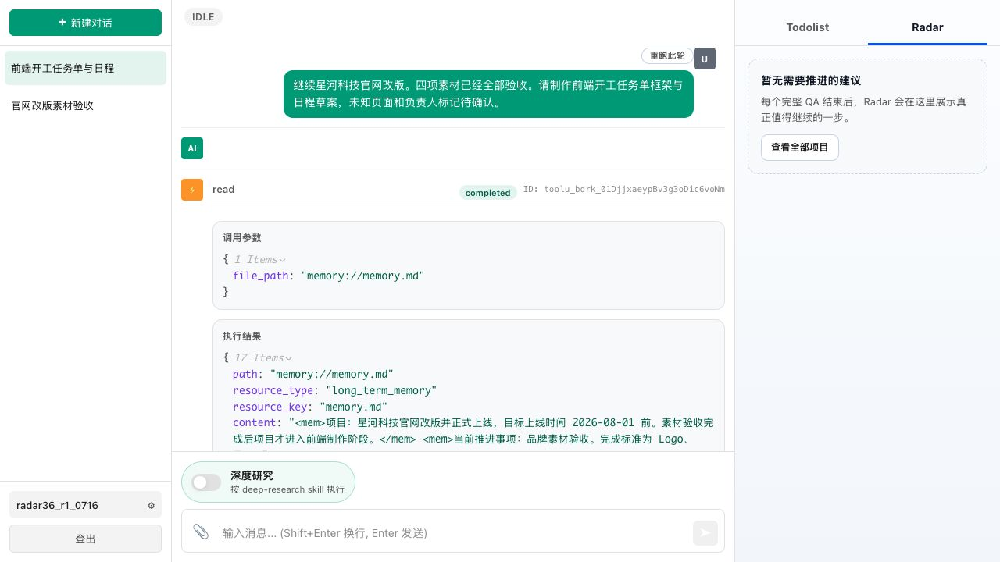
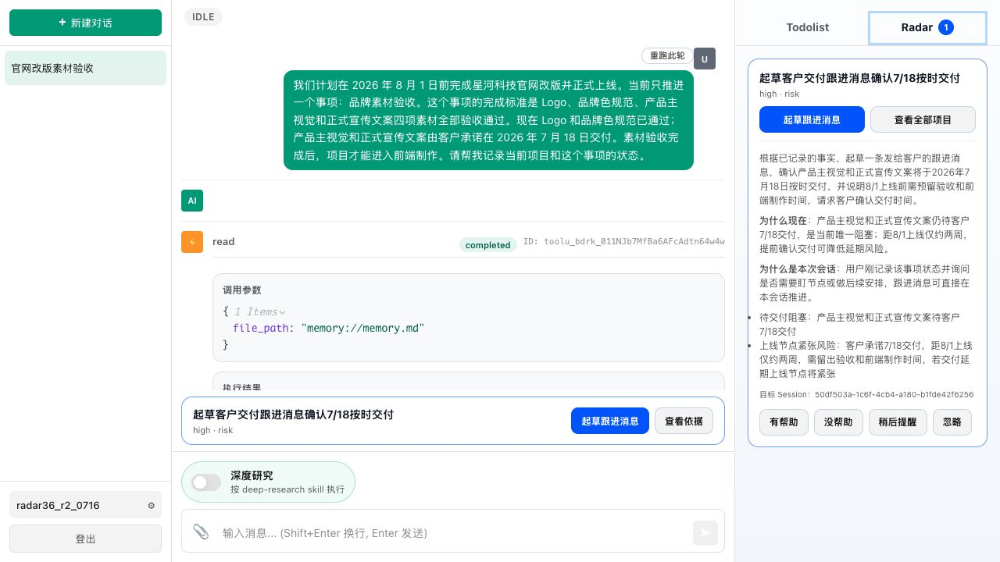
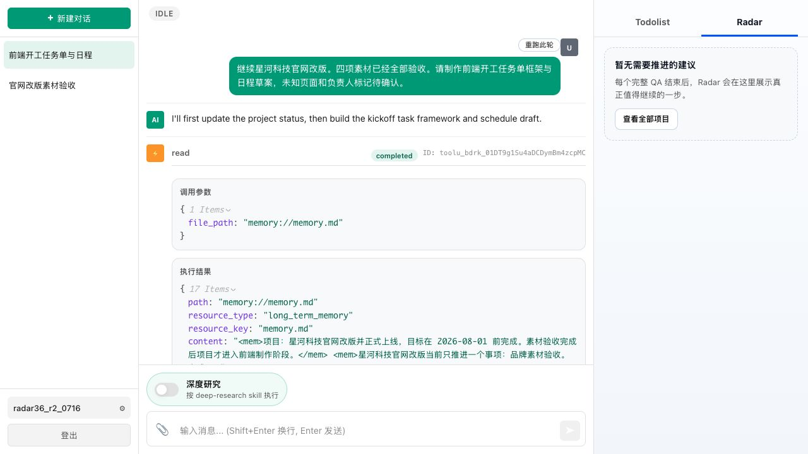
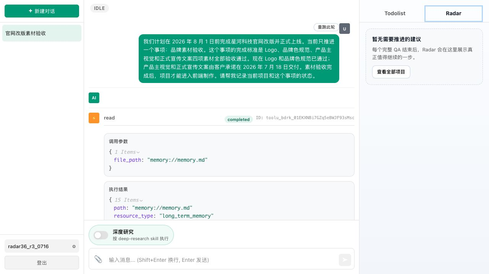
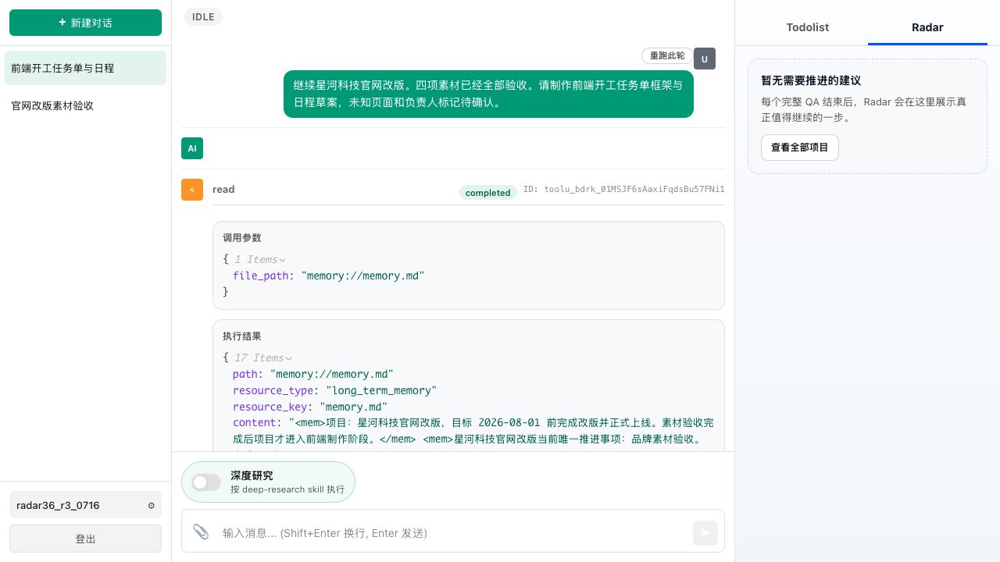

# 3.6 用户已要求同一动作稳定性实测

## 1. 验证目标

验证用户已经明确要求制作前端开工任务单与日程草案，且主 Agent 已实际产出后，Radar 不得再次建议生成或完善同一份任务单。同时观察复用的 Session A 在客户承诺期内是否保持安静。

## 2. 最终脚本

Session A：

> 我们计划在 2026 年 8 月 1 日前完成星河科技官网改版并正式上线。当前只推进一个事项：品牌素材验收。这个事项的完成标准是 Logo、品牌色规范、产品主视觉和正式宣传文案四项素材全部验收通过。现在 Logo 和品牌色规范已通过；产品主视觉和正式宣传文案由客户承诺在 2026 年 7 月 18 日交付。素材验收完成后，项目才能进入前端制作。请帮我记录当前项目和这个事项的状态。

Session B：

> 继续星河科技官网改版。四项素材已经全部验收。请制作前端开工任务单框架与日程草案，未知页面和负责人标记待确认。

预期：Session A 在客户承诺期内保持 Radar 安静；Session B 主 Agent 实际生成任务单与日程后，Radar 安静。

## 3. 三次隔离账号实测

| 次数 | 账号 | Session A | Session B | 结果 |
|---|---|---|---|---|
| 1 | `radar36_r1_0716` | 客户仍在承诺期内，Radar 安静 | 主 Agent 生成任务单与日程，Radar 安静 | 通过 |
| 2 | `radar36_r2_0716` | Radar 提前建议“起草客户交付跟进消息确认 7/18 按时交付” | 主 Agent 生成可下载任务单与日程，Radar 安静 | 产品问题 |
| 3 | `radar36_r3_0716` | 客户仍在承诺期内，Radar 安静 | 主 Agent 生成任务单与日程，Radar 安静 | 通过 |

第 1 次：

第 2 次：

第 3 次：

## 4. 结论

核心去重目标稳定通过：三次 Session B 中主 Agent 都实际产出了前端开工任务单与日程，Radar 三次均没有重复提醒。

但完整 Case 未达到连续三次通过。第 2 次 Session A 在 7 月 16 日就建议向承诺 7 月 18 日交付的客户发送确认消息，属于承诺期内提前催办；另两次 Session A 保持安静。最终状态为“用户已要求同一动作的去重 `3 / 3` 正确，但承诺期时机判断 `2 / 3`，存在不稳定产品问题”。按 Goal 约束仅记录证据，不修改代码、不重启服务。
