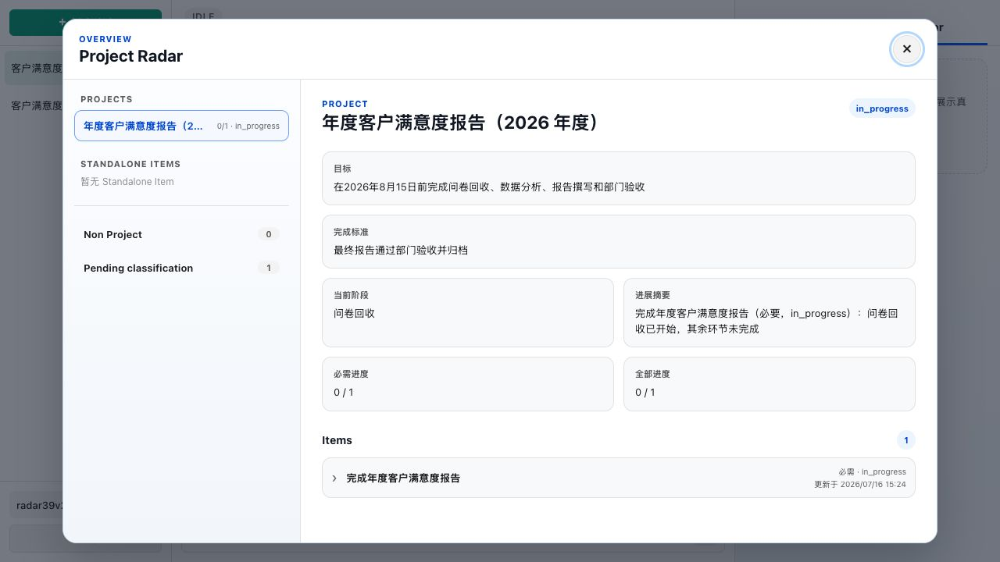
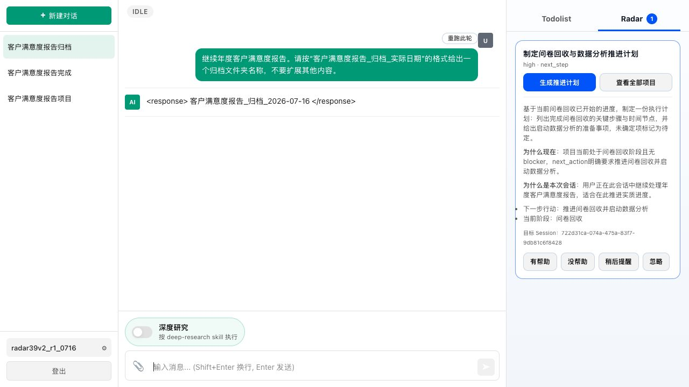
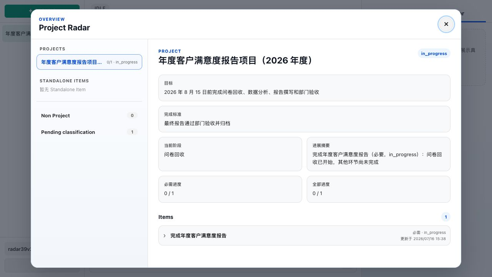
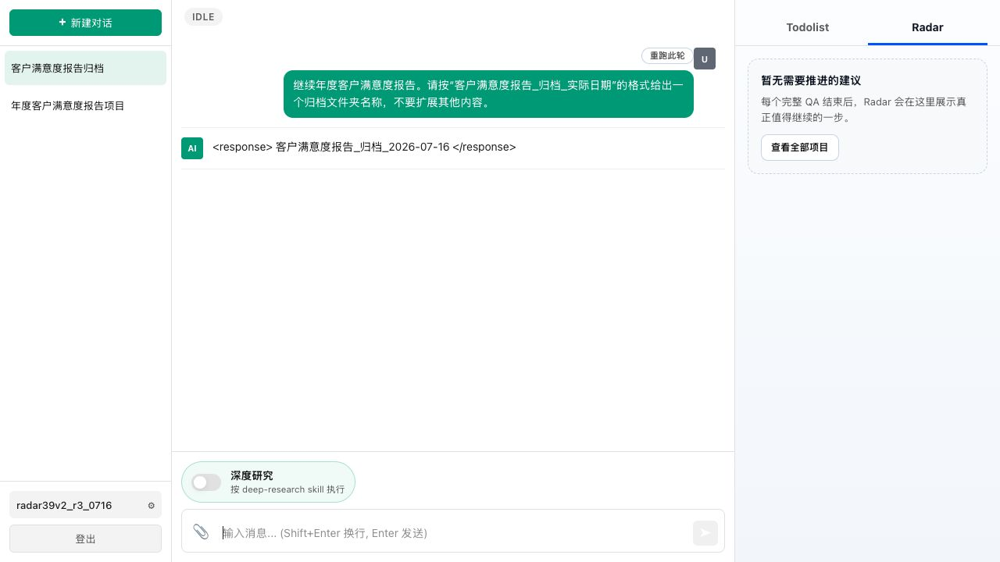

# 3.9 已完成项目稳定性实测

> 实测日期：2026-07-16
> 
> 目的：验证项目与事项都已明确完成后，后续无关紧要的问答不会再次推动项目。

## 1. 最终脚本

### Session A

> 我们启动年度客户满意度报告项目，目标是在 2026 年 8 月 15 日前完成问卷回收、数据分析、报告撰写和部门验收。当前只建立一个事项：完成年度客户满意度报告。完成标准是最终报告通过部门验收并归档。现在问卷回收已开始，其他环节尚未完成。请记录项目和事项的当前状态，不要把项目标记为完成。

### Session B

> 继续年度客户满意度报告项目。问卷回收、数据分析、报告撰写和部门验收现在已经全部完成，最终报告已经通过部门验收并完成归档，所有必要事项均已完成。请把“完成年度客户满意度报告”事项标记为完成，并把整个项目标记为完成；只确认记录结果，不要提出后续建议。

### Session C

> 继续年度客户满意度报告。请按“客户满意度报告_归档_实际日期”的格式给出一个归档文件夹名称，不要扩展其他内容。

## 2. 三次结果

| 次数 | 账号 | 主回答 | Project/Item 结构化状态 | Radar | 判定 |
|---|---|---|---|---|---|
| 1 | `radar39v2_r1_0716` | B 确认完成；C 给出文件夹名 | 仍为 `in_progress`，0/1 | C 误推旧的推进计划 | 产品问题 |
| 2 | `radar39v2_r2_0716` | B 确认完成；C 给出文件夹名 | 仍为 `in_progress`，0/1 | C 最终安静 | 产品问题 |
| 3 | `radar39v2_r3_0716` | B 确认完成；C 给出文件夹名 | 仍为 `in_progress`，0/1 | C 最终安静 | 产品问题 |

## 3. 结论

三次都出现同一问题：主 Agent 和记忆记录已经写入“事项/项目已完成”，但 Project Radar 总览仍显示 `in_progress`，必要进度为 `0/1`。因此问题不是 Case 文案，也不是 Radar 是否应该提醒，而是 Organizer 的完成事实没有同步到 Project/Item 结构化表。

第 1 次 Session C 因读取到旧的 `in_progress` 状态而误推 Radar；第 2、3 次虽然最终 Radar 安静，但结构化状态仍错误，不能判为通过。

## 4. 证据截图

## 5. 处理建议

记录为产品阻塞项：Organizer 必须在确认 Item 完成后，按完成守门规则更新 Item 与 Project 的结构化状态；在此修复前不把 3.9 计为通过，不修改 Case 文案、不重启服务。
