# Case 6 阻塞解除与主动推进实测

> 文档状态：已完成  
> 测试日期：2026-07-14  
> 测试账号：`case3_ui_0714`  
> 权威范围：阻塞解除 Case 第 3 版的浏览器 UI 操作、完整页面截图、Project / Item 状态与 Radar 结果

[返回文档总览](../../README.md)

## 1. 测试目标与结论

本次从全新账号开始，通过两个独立 Session 验证以下链路：

```text
四项客户材料缺失，前端制作暂停
→ Post-run 创建 Project 和 waiting Item
→ 新 Session 确认四项材料全部交付验收
→ 主 Agent 只完成文件归档命名
→ Post-run 清除阻塞并将 Item 更新为 open
→ Radar 主动建议生成前端开工任务单和排期
```

最终结果：**测试通过。** 主 Agent 没有在最终回答中制定前端开工计划；Project Radar 基于跨 Session 状态识别出四项材料齐备、开工阻塞解除，并结合 7 月 18 日合同期限生成了高优先级建议“制定前端开工任务单并排期”。

## 2. 第 0 步：建立空白基线

使用全新账号 `case3_ui_0714`。进入聊天主页时没有历史会话，确保本次 Project、Item、Event 和 Radar 不受旧测试数据影响。

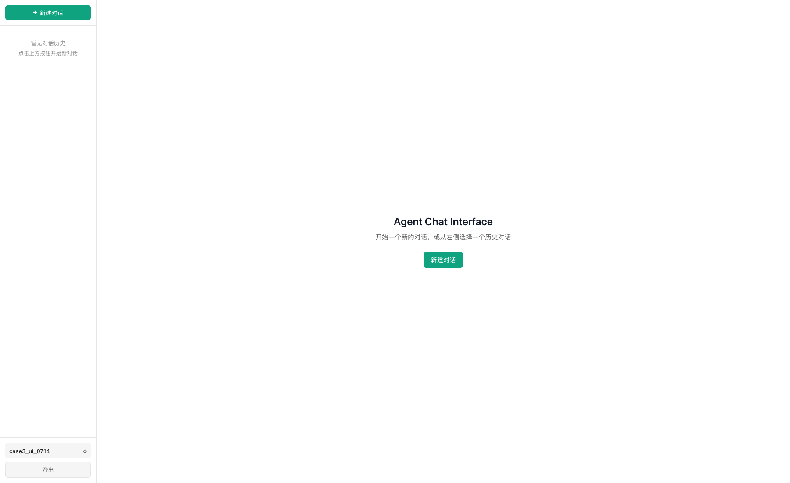

## 3. Session A：建立暂停和阻塞状态

### 3.1 新建会话

从主页点击“新建对话”，创建记录项目初始状态的 Session A。

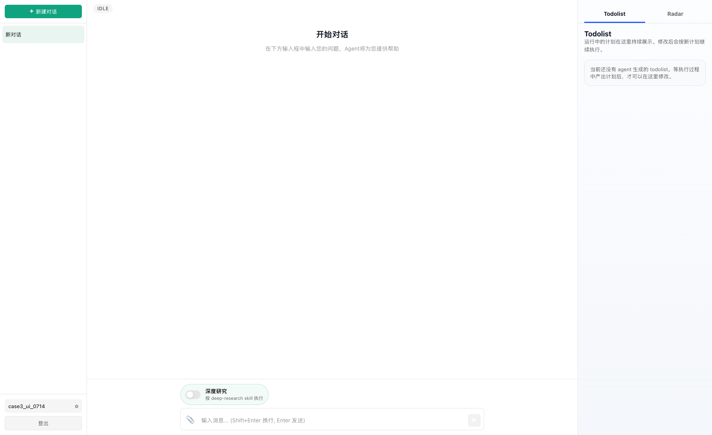

### 3.2 输入项目状态

在输入框中填写合同期限、四项缺失材料、暂停规则以及尚未制定开工任务单的信息。

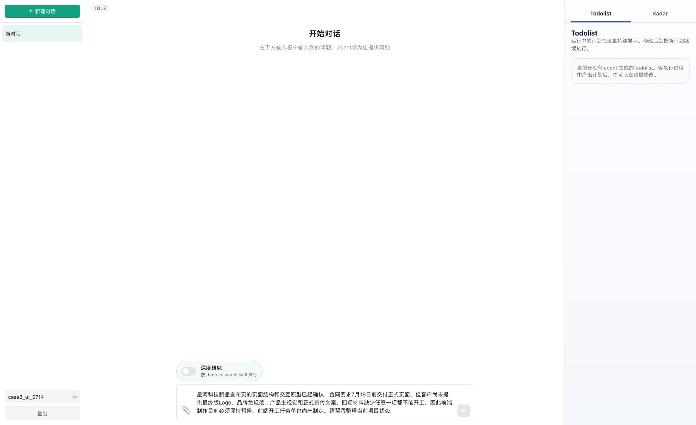

发送后页面进入运行状态。

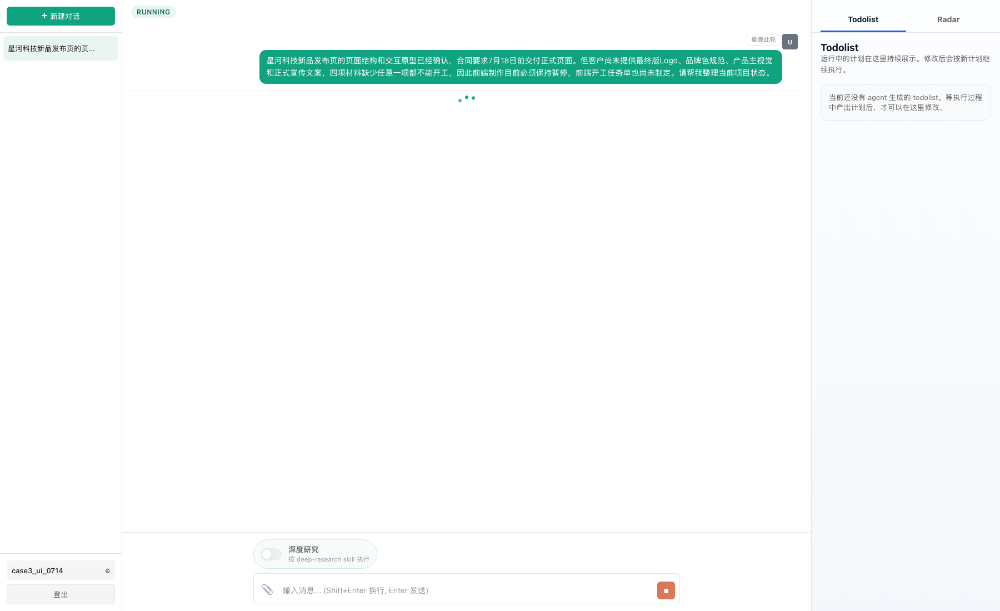

### 3.3 主 Agent 完成当前请求

主 Agent 将页面结构和交互原型标记为已确认，将四项客户材料列为开工前置条件，并指出距离 7 月 18 日只剩约四天。当前回答完成了用户要求的项目状态整理。

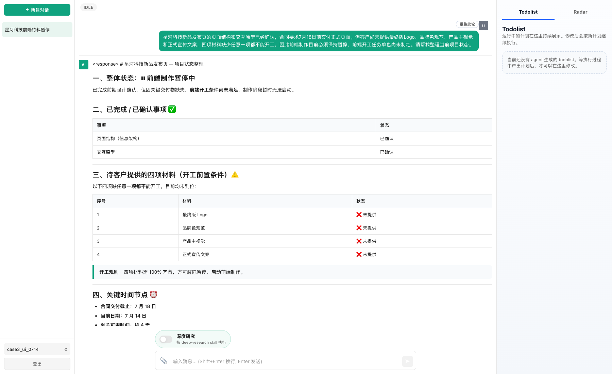

### 3.4 第一轮 Post-run

第一轮结束后 Radar 保持安静。材料尚未到位，前端制作仍不能启动，此时没有必要推送开工任务单。

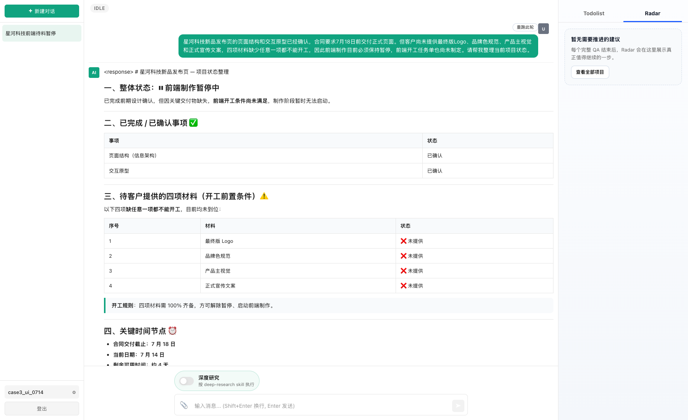

“查看全部项目”显示：

- Project：星河科技新品发布页；
- 当前阶段：前端制作暂停中，等待客户材料；
- Item：前端制作（等待客户四项材料齐备后开工）；
- Item 状态：`waiting`；
- 必需进度：`0 / 1`。

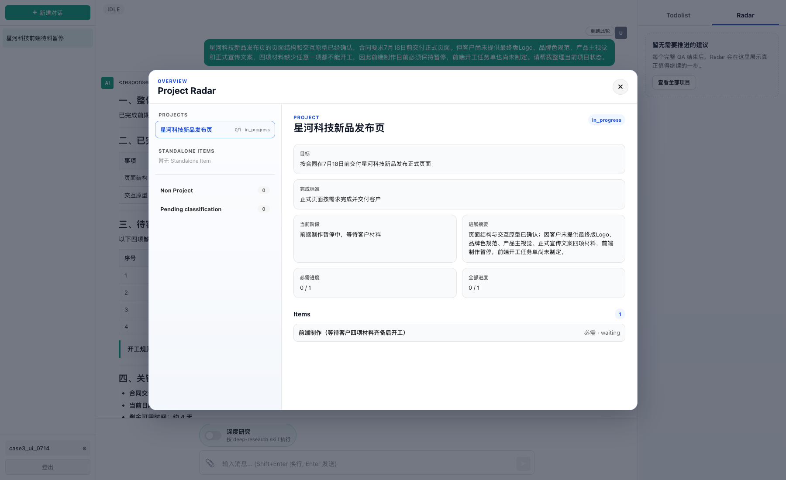

## 4. Session B：材料齐备但只处理归档

### 4.1 新建独立会话

新建 Session B，验证新 QA 能否更新 Session A 已建立的同一 Project 和 Item。

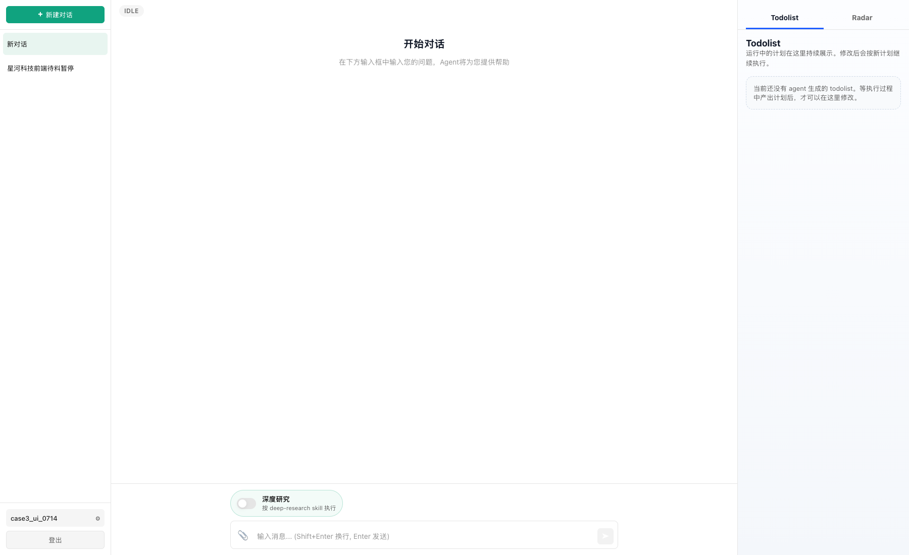

### 4.2 输入材料齐备事实

用户确认最终版 Logo、品牌色规范、产品主视觉和正式宣传文案均已交付并验收，但当前只要求生成四个统一格式的归档文件名。

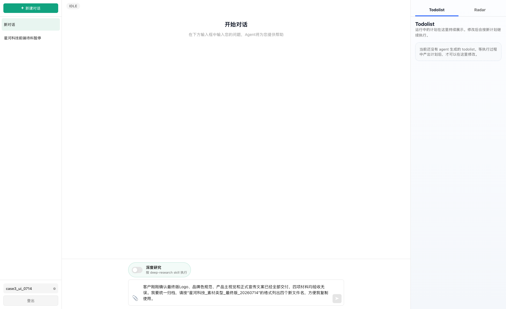

发送后页面进入运行状态。


### 4.3 主 Agent 完成当前请求

主 Agent 输出四个归档文件名，最终回答没有制定前端开工任务单或项目排期。运行过程中主 Agent 额外将“材料齐备、阻塞解除、7 月 18 日截止”写入长期 Memory；这不替代后续 Project / Item 的结构化状态更新。

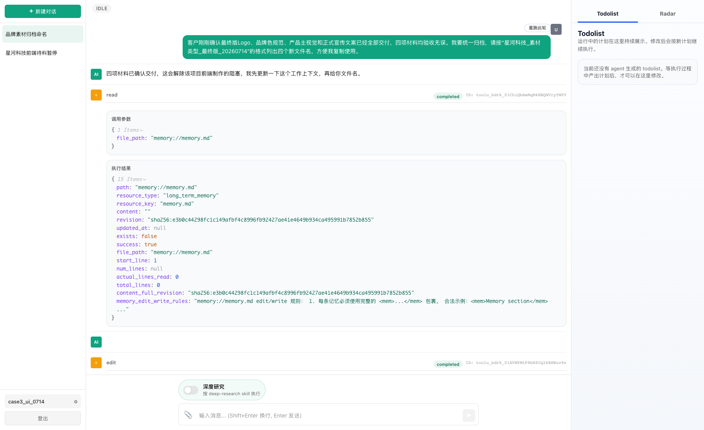

### 4.4 第二轮 Post-run 更新状态

“查看全部项目”显示本轮 Event 已归入原 Project，状态变为：

- 当前阶段：客户四项材料齐备，前端制作即将开工；
- 进展：四项材料全部交付验收；
- 原材料阻塞已解除；
- Item 状态：`waiting → open`；
- 尚待制定开工任务单。

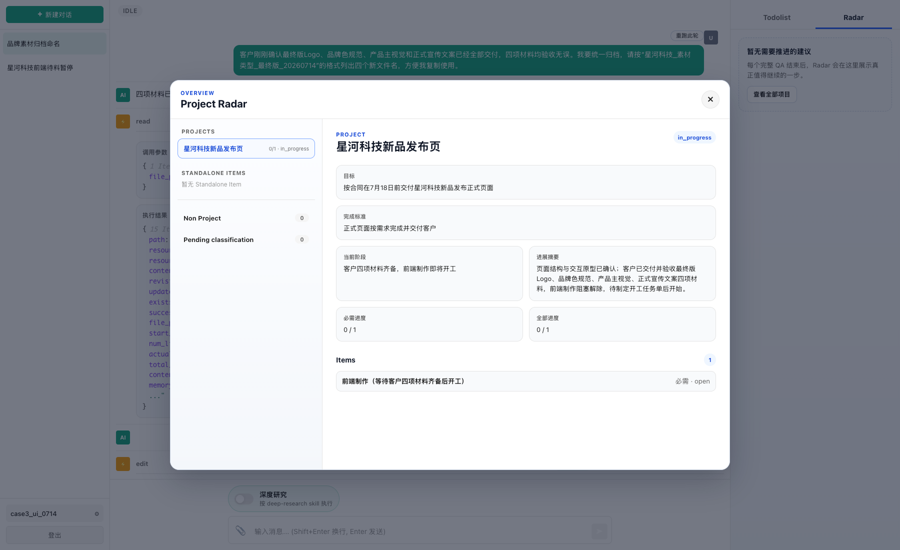

## 5. Re-entry 与 Radar 主动建议

本轮 Organizer 和 Radar Analyzer 为异步分阶段执行。主回答结束后的有限轮询期间页面一度仍显示空 Radar；刷新并重新进入 Session B 后，页面读取到已经生成的建议。Re-entry 只恢复已有结果，没有重新触发模型扫描。

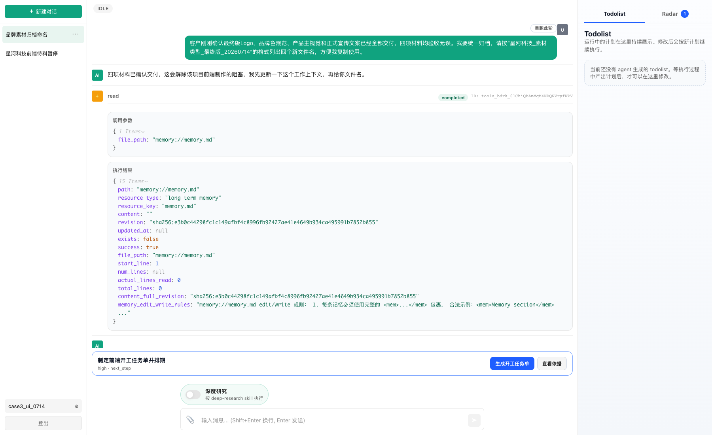

最终 Radar 内容为：

- 标题：制定前端开工任务单并排期；
- 优先级：`high`；
- 类型：`next_step`；
- 动作：生成开工任务单；
- 为什么现在：四项开工条件刚全部满足，距合同截止仅约四天；
- 为什么是本次会话：本会话刚确认四项材料验收归档；
- 预计产物：按切图、组件开发、内容填充、联调测试拆分任务，安排至 7 月 18 日并标注缓冲点。

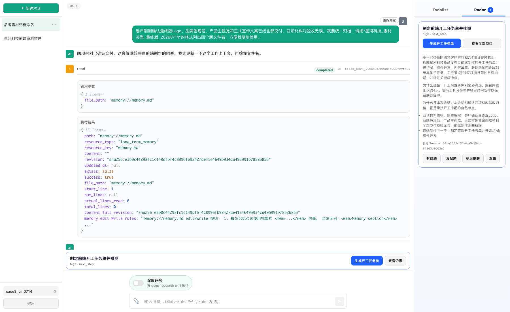

## 6. 最终判定

| 验证项 | 实际结果 | 判定 |
|---|---|---|
| Session A 建立 Project / Item | 创建一个 Project 和一个必需 Item | 通过 |
| 初始阻塞状态 | Item 为 `waiting`，等待四项客户材料 | 通过 |
| 第一轮低打扰 | 材料未齐时 Radar 保持安静 | 通过 |
| 跨 Session 归属 | Session B 更新原 Project / Item | 通过 |
| 阻塞解除 | 四项材料齐备后 Item 更新为 `open` | 通过 |
| 主回答职责边界 | 最终回答只完成归档文件命名 | 通过 |
| Radar 主动推进 | 生成前端开工任务单与排期建议 | 通过 |
| 建议可解释性 | 包含原因、证据、时机和目标 Session | 通过 |

本 Case 证明：用户本轮只处理素材归档时，Project Radar 可以理解该事实对整个项目的影响，发现前端制作已从“等待材料”转为“必须立即开工”，并主动提供一个可直接交给 Agent 执行的下一步。

## 7. 复现输入附录

### Session A

> 星河科技新品发布页的页面结构和交互原型已经确认，合同要求7月18日前交付正式页面。但客户尚未提供最终版Logo、品牌色规范、产品主视觉和正式宣传文案，四项材料缺少任意一项都不能开工，因此前端制作目前必须保持暂停，前端开工任务单也尚未制定。请帮我整理当前项目状态。

等待主 Agent 回答结束，并确认 Project / Item 已完成 Post-run 整理后再新建 Session B。

### Session B

> 客户刚刚确认最终版Logo、品牌色规范、产品主视觉和正式宣传文案已经全部交付，四项材料均验收无误。我要统一归档，请按“星河科技_素材类型_最终版_20260714”的格式列出四个新文件名，方便我复制使用。

等待主 Agent 回答和 Post-run 完成；若有限轮询期间仍显示空 Radar，刷新页面并重新进入 Session B，读取已有 Radar 结果。
